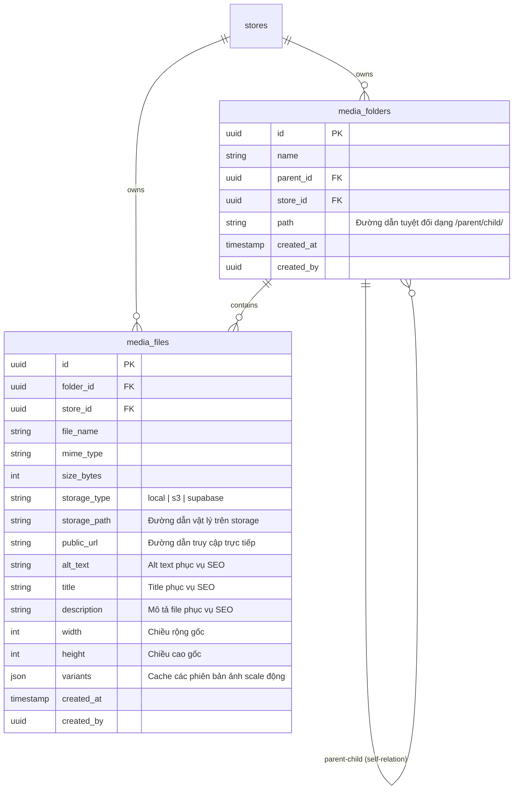
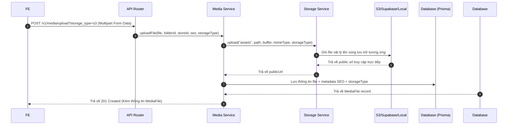

# Hệ Thống Quản Lý Media & Lưu Trữ (Media System Guide)

Tài liệu này cung cấp cái nhìn toàn diện về kiến trúc hệ thống Media, mối quan
hệ giữa Thư mục (`media_folders`) và Tập tin (`media_files`), cơ chế Strategy
Pattern lưu trữ động, tính năng tự động Scale ảnh và cách thức tích hợp dành cho
Front-End (FE).

---

## 1. Mô Hình Thực Thể & Quan Hệ (Database Schema)

Hệ thống Media được tổ chức dưới dạng cấu trúc cây thư mục phân cấp giống như hệ
điều hành máy tính, hỗ trợ lưu trữ đa cửa hàng (Multi-Store Isolation) và tối ưu
hóa SEO.

### Sơ Đồ Mermaid Quan Hệ Thực Thể (ERD)



### Chi Tiết Cấu Trúc Quan Hệ

1. **Quan hệ Đệ Quy Thư Mục (Self-Referencing Relationship):**
   - Một thư mục có thể có tối đa **một** thư mục cha (`parentId`) thông qua
     quan hệ `parent`.
   - Một thư mục có thể chứa **nhiều** thư mục con (`children`).
   - **Cơ chế Path-Materialization:** Trường `path` lưu trữ chuỗi đường dẫn từ
     gốc (ví dụ: `/` đối với root, `/Hinh_Anh/` cho thư mục con,
     `/Hinh_Anh/Banner/` cho cháu). Việc này giúp truy vấn tìm kiếm đệ quy toàn
     bộ con cháu cực kỳ nhanh chóng bằng toán tử `LIKE "path%"` thay vì phải
     truy vấn đệ quy DB phức tạp.

2. **Quan hệ Thư mục & Tập tin (Folders & Files):**
   - Một tập tin (`MediaFile`) thuộc về tối đa **một** thư mục (`MediaFolder`).
     Nếu `folderId = null`, file đó nằm ngoài thư mục gốc (Root).
   - Một thư mục có thể chứa **nhiều** tập tin. Khi xóa thư mục, Front-End có
     thể dễ dàng hiển thị cảnh báo nhờ ràng buộc quan hệ này.

3. **Cô Lập Đa Cửa Hàng (Multi-Store Isolation):**
   - Cả thư mục và tập tin đều có trường `storeId`.
   - **Đối với Nhân viên (Tier != "owner"):** Chỉ có thể nhìn thấy, tạo, và quản
     lý các file/folder có `storeId` bằng với Store ID mà họ đang làm việc
     (Context Store).
   - **Đối với Hệ thống/Owner:** Có thể quản lý các file toàn cầu
     (`storeId = null`) hoặc xem tất cả các file của toàn bộ cửa hàng.

---

## 2. Kiến Trúc Lưu Trữ Động (Dynamic Storage Strategy)

Hệ thống hỗ trợ cơ chế Strategy Pattern, cho phép Front-End chỉ định nơi lưu trữ
tập tin ngay khi gọi API upload thông qua tham số `storage_type`.

### Các Storage Provider Hỗ Trợ:

- `local`: Lưu trữ trực tiếp trên ổ cứng của backend (dưới thư mục
  `./uploads/`). Phù hợp cho môi trường Development hoặc VPS độc lập.
- `s3`: Lưu trữ đám mây tương thích AWS S3, MinIO, DigitalOcean Spaces, v.v...
- `supabase`: Lưu trữ đám mây thông qua Supabase Storage.

### Luồng Hoạt Động Của API Upload:



---

## 3. Scale Ảnh Tự Động & Cache Biến Thể (On-The-Fly Image Resizing)

Nhằm tối ưu hóa hiệu năng tải trang và trải nghiệm người dùng (SEO tốt hơn nhờ
tải ảnh kích thước chuẩn), hệ thống hỗ trợ scale ảnh tự động theo chiều rộng
(`w`), chiều cao (`h`) và kiểu cắt (`fit`).

### Cách Thức Hoạt Động (On-the-fly & Cache):

1. Khi FE gọi link xem/tải ảnh: `/v1/media/:id/download?w=300&h=300&fit=cover`.
2. Hệ thống kiểm tra xem kích thước ảnh này đã từng được tạo chưa trong trường
   `variants` dạng JSON của DB:
   - **Cache Hit:** Nếu đã tồn tại key `300x300_cover`, hệ thống lập tức thực
     hiện **Redirect 302 trực tiếp** trình duyệt của user đến CDN/Đường dẫn của
     ảnh đã scale đó. Không tải lại backend, bảo toàn hiệu năng.
   - **Cache Miss:**
     1. Hệ thống tự động tải file gốc từ Storage tương ứng (`local`, `s3` hoặc
        `supabase`).
     2. Dùng thư viện hiệu năng cao **Sharp** để resize ảnh theo đúng kích thước
        được yêu cầu một cách an toàn.
     3. Upload phiên bản ảnh đã scale lên **cùng Storage Provider của ảnh gốc**.
     4. Cập nhật URL ảnh đã scale vào trường `variants` trong DB phục vụ cho các
        lần gọi sau.
     5. Redirect 302 trình duyệt đến URL ảnh mới scale.

---

## 4. Hướng Dẫn Tích Hợp Dành Cho Front-End (FE Integration Guide)

### 4.1. Đăng Nhập & Cấu Hình Header Context

Tất cả các API media (ngoại trừ API xem ảnh công khai) đều yêu cầu token Bearer
và header `x-api-key` đối với tài khoản nhân viên.

```javascript
// Cấu hình Axios Interceptor
axios.interceptors.request.use((config) => {
  const token = localStorage.getItem("accessToken");
  const storeId = localStorage.getItem("currentStoreId"); // Lấy store context hiện tại

  if (token) {
    config.headers.Authorization = `Bearer ${token}`;
  }
  // Đính kèm Store Context cho nhân viên thường (Owner không bắt buộc)
  if (storeId) {
    config.headers["x-api-key"] = storeId;
  }
  return config;
});
```

---

### 4.2. API Đọc Cây Thư Mục & Phân Trang Tập Tin

**Endpoint:** `GET /v1/media`

API này trả về toàn bộ thư mục (để vẽ cây thư mục) và danh sách file có phân
trang của thư mục hiện tại.

- **Query Parameters:**
  - `parentId`: ID của thư mục cha cần xem (không truyền = Root).
  - `page`: Trang cần xem (mặc định = `1`).
  - `limit`: Giới hạn file mỗi trang (mặc định = `50`).
  - `search`: Từ khóa tìm kiếm tên file/thư mục (tùy chọn).

- **Phản Hồi Mẫu (200 OK):**

```json
{
  "success": true,
  "data": {
    "folders": [
      {
        "id": "e4f8a6b2-...",
        "name": "Banners",
        "parentId": null,
        "path": "/",
        "createdAt": "2026-05-19T08:00:00Z"
      }
    ],
    "files": [
      {
        "id": "7a012989-...",
        "folderId": null,
        "fileName": "banner-tet.jpg",
        "mimeType": "image/jpeg",
        "sizeBytes": 204800,
        "storageType": "local",
        "publicUrl": "/uploads/assets/media/global/root/7a012989-banner-tet.jpg",
        "altText": "Banner Tết Nguyên Đán",
        "title": "Banner Tết",
        "width": 1920,
        "height": 1080,
        "createdAt": "2026-05-19T08:05:00Z"
      }
    ],
    "meta": {
      "total": 125,
      "page": 1,
      "limit": 50,
      "totalPages": 3
    }
  }
}
```

---

### 4.3. API Tạo Thư Mục Mới

**Endpoint:** `POST /v1/media/folders`

- **Body (JSON):**

```json
{
  "name": "Sản phẩm",
  "parentId": "e4f8a6b2-..." // ID của thư mục cha (tùy chọn)
}
```

---

### 4.4. API Upload Tập Tin (Hỗ Trợ Chọn Nơi Lưu Trữ & SEO)

**Endpoint:** `POST /v1/media/upload`

- **Query Parameters (Tùy chọn):**
  - `folderId`: ID thư mục muốn lưu file vào.
  - `storage_type`: `local` | `s3` | `supabase` (Mặc định = `local` nếu không
    truyền).
  - `altText`: Chuỗi mô tả hình ảnh hỗ trợ SEO.
  - `title`: Tiêu đề của file.
  - `description`: Mô tả chi tiết file.

- **Body (Multipart Form-Data):**
  - `file`: Binary dữ liệu (Chọn từ thẻ `<input type="file" />`).

- **Mã Code JS Gửi Request:**

```javascript
const uploadMedia = async (fileObj, folderId, storageType = "local") => {
  const formData = new FormData();
  formData.append("file", fileObj);

  const response = await axios.post(
    `/v1/media/upload?folderId=${
      folderId || ""
    }&storage_type=${storageType}&altText=AnhSanPham`,
    formData,
    {
      headers: {
        "Content-Type": "multipart/form-data",
      },
    },
  );
  return response.data;
};
```

---

### 4.5. Hiển Thị Hình Ảnh Scale Chuẩn SEO Trên Giao Diện

Để hiển thị hình ảnh tối ưu dung lượng và tăng tốc độ tải trang di động
(Mobile), FE **không nên** dùng trực tiếp link `publicUrl` gốc. Thay vào đó hãy
dùng API download scale ảnh như sau:

- **Thẻ Image trong React / Vue:**

```html
<!-- Load ảnh thumbnail 150x150 dạng vuông, cắt góc tự động -->


<!-- Load ảnh banner rộng 800px, chiều cao tự động co dãn theo tỷ lệ -->

```

- **Các giá trị `fit` được hỗ trợ:**
  - `cover` (Mặc định): Cắt cúp ảnh để vừa khít khung hình chỉ định mà không
    biến dạng.
  - `contain`: Thu phóng ảnh giữ nguyên tỷ lệ để nằm gọn hoàn toàn bên trong
    khung.
  - `fill`: Thu phóng ảnh và ép khít (chấp nhận méo ảnh nếu sai tỷ lệ).
  - `inside`: Scale ảnh nằm trong khung nhưng không phóng to hơn ảnh gốc.
  - `outside`: Scale ảnh phủ ngoài khung nhưng không phóng to hơn ảnh gốc.

```
```
