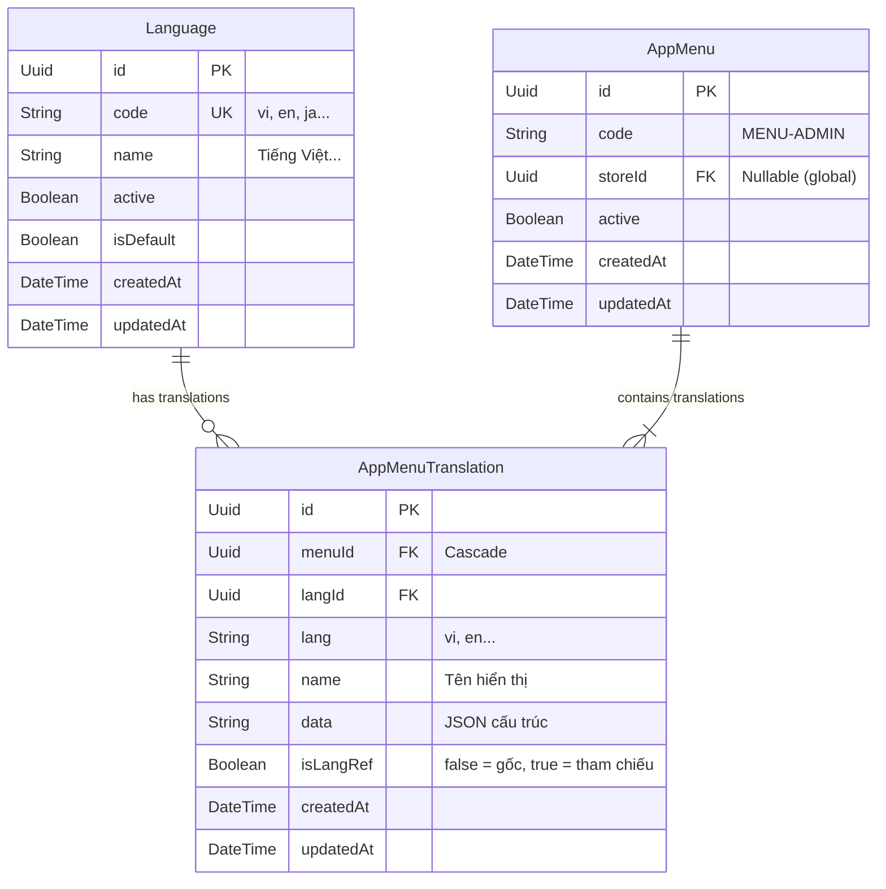
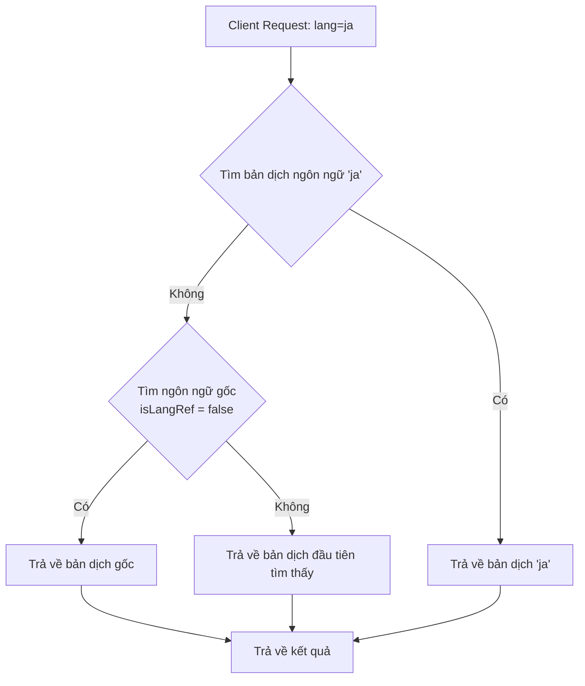

# Kiến Trúc Đa Ngôn Ngữ & Đa Cửa Hàng (Multilingual & Multi-store Architecture)

Tài liệu này đặc tả thiết kế kiến trúc, mô hình dữ liệu, cơ chế vận hành và các
tiêu chuẩn bảo mật cho tính năng đa ngôn ngữ kết hợp đa cửa hàng (multi-store)
áp dụng trên nền tảng **Deno 2**, **Hono**, và **Prisma 7**.

---

## 1. Triết Lý Thiết Kế (Design Philosophy)

Để giải quyết bài toán đa ngôn ngữ trong hệ thống thương mại điện tử đa cửa
hàng, nền tảng lựa chọn mô hình **Master - Translation Pattern (Mô hình Chủ -
Dịch)** thay vì lưu trữ phẳng (Flat Table) hay sử dụng cột JSON thô.

### Ưu điểm vượt trội của Master - Translation:

1. **Tránh Lệch Cấu Hình (Configuration Drift)**: Các thông số cấu hình chung
   (như trạng thái kích hoạt `active`, liên kết cửa hàng `storeId`, mã nhận diện
   `code`, và nhật ký kiểm toán Audit Logs) chỉ lưu duy nhất 1 lần tại bảng
   Master.
2. **Toàn Vẹn Dữ Liệu**: Mọi ngôn ngữ tham chiếu (Translations) được liên kết
   cứng qua khóa ngoại với cơ chế `onDelete: Cascade`. Khi xóa Master, toàn bộ
   bản dịch tự động bị dọn dẹp sạch sẽ.
3. **Chuẩn Hóa SQL**: Dễ dàng đánh chỉ mục (Index), truy vấn tìm kiếm (Search),
   phân trang (Pagination) tốc độ cao và tận dụng tối đa thế mạnh của quan hệ cơ
   sở dữ liệu PostgreSQL.

---

## 2. Mô Hình Dữ Liệu (Database Schema)

Kiến trúc bao gồm 3 thực thể cốt lõi: `Language` (Danh mục ngôn ngữ), thực thể
Master (`AppMenu`), và thực thể Dịch (`AppMenuTranslation`).



### Quy Tắc Ràng Buộc Duy Nhất (Unique Constraints):

- **Bảng Master (`AppMenu`)**: Ràng buộc duy nhất `@@unique([code, storeId])`
  đảm bảo một mã menu chỉ tồn tại tối đa một lần cho mỗi cửa hàng (hoặc ở cấp
  global nếu `storeId` mang giá trị `null`).
- **Bảng Dịch (`AppMenuTranslation`)**: Ràng buộc duy nhất
  `@@unique([menuId, lang])` đảm bảo mỗi menu chỉ có duy nhất một bản dịch cho
  một ngôn ngữ cụ thể.

---

## 3. Cơ Chế Dự Phòng Thông Minh (Smart Fallback Mechanism)

Để đảm bảo trải nghiệm người dùng luôn mượt mà và không bao giờ gặp lỗi trống
màn hình khi một menu chưa kịp biên dịch ngôn ngữ yêu cầu, hệ thống triển khai
cơ chế **Fallback tự động**:



### Triển khai trong Service Layer (TypeScript):

```typescript
const rawMenus = await this.prisma.appMenu.findMany({
  where,
  skip,
  take: limit,
  include: {
    translations: {
      where: {
        OR: [
          { lang },
          { isLangRef: false }, // Lấy kèm ngôn ngữ gốc làm fallback
        ],
      },
    },
  },
});

// Map kết quả trong JavaScript
const result = rawMenus.map((menu) => {
  let translation = menu.translations.find((t) => t.lang === requestedLang);
  if (!translation) {
    // Dự phòng ngôn ngữ gốc
    translation = menu.translations.find((t) => !t.isLangRef) ||
      menu.translations[0];
  }
  return {
    ...menu,
    name: translation?.name ?? "",
    data: translation?.data ?? "[]",
  };
});
```

### 3.1. Cơ Chế Phát Hiện Ngôn Ngữ Thiếu (Missing Languages Detection)

Để hỗ trợ giao diện quản trị (CMS/Frontend) biết được bản ghi hiện tại đang
thiếu những bản dịch nào so với các ngôn ngữ đang hoạt động (`active: true`) của
hệ thống, mỗi khi truy vấn chi tiết hoặc danh sách, hệ thống tự động trả về
trường `missingLanguages`:

```json
"missingLanguages": [
  { "code": "ko", "name": "한국어" },
  { "code": "ja", "name": "日本語" }
]
```

**Nguyên lý hoạt động**:

1. Hệ thống truy vấn danh sách ngôn ngữ đang được kích hoạt:
   `prisma.language.findMany({ where: { active: true } })`.
2. Lọc bỏ các ngôn ngữ đã có trong mảng `translations` của bản ghi.
3. Trả về mảng các ngôn ngữ còn thiếu giúp FE hiển thị danh sách nút thêm nhanh
   bản dịch và loại trừ các ngôn ngữ không hoạt động (`active: false`).

---

## 4. Bảo Mật Ranh Giới Cửa Hàng (Store Context Security)

Hệ thống bắt buộc áp dụng nguyên tắc **Cô Lập Đa Cửa Hàng (Store Boundary
Isolation)** để ngăn chặn việc người quản lý của cửa hàng này chỉnh sửa hoặc xem
trộm dữ liệu của cửa hàng khác (bằng cách tiêm tham số `storeId` giả vào body
hoặc query).

### Ràng buộc bảo mật tại Controller (Router Layer):

1. **Lọc dữ liệu**: Mọi câu lệnh truy vấn tìm kiếm (`findMany`, `findById`,
   `findByCode`) của người dùng có cấp bậc thường (Non-Owner) đều bị cưỡng chế
   lọc theo `clientCtx.storeId` lấy từ JWT Token đã kiểm định.
2. **Cưỡng chế ghi đè ghi nhận (Mutation Overwrite)**: Tại các Route thay đổi dữ
   liệu (`POST`, `PATCH`, `PUT`), nếu người dùng không thuộc nhóm quản trị hệ
   thống (`payload.tier !== "owner"`), hệ thống sẽ **luôn luôn bắt buộc ghi đè**
   `storeId` bằng mã cửa hàng của chính họ:

```typescript
// Trích xuất tại POST / PATCH / PUT Routes
let forcedStoreId = body.storeId;
if (payload.tier !== "owner") {
  // Cưỡng chế chỉ được thao tác trên store của chính mình
  forcedStoreId = clientCtx.storeId;
} else {
  forcedStoreId = body.storeId ?? clientCtx.storeId;
}
```

---

## 5. Danh Sách API Endpoints & Cú Pháp Tương Tác

Hệ thống phân định rõ hai nhóm API: **API dành cho Client (Giao diện hiển thị)**
và **API dành cho Admin (Quản trị dịch thuật)**.

### A. API dành cho Client (Tự động Fallback & bảo mật Store)

- **Lấy toàn bộ menu phù hợp**:
  - **Endpoint**: `GET /v1/app-menus`
  - **Header**:
    - `x-api-key`: `STORE_ID` (Bắt buộc với non-owner)
    - `x-lang`: `en` (Ngôn ngữ yêu cầu, mặc định `vi`)
  - **Response**: Danh sách menu chứa `name` và `data` đã tự động phân giải hoặc
    fallback.

- **Lấy chi tiết một menu**:
  - **Endpoint**: `GET /v1/app-menus/:idOrCode`
  - **Response**: Chi tiết menu theo ngôn ngữ yêu cầu.

### B. API dành cho Admin (Quản trị & Cập nhật bản dịch)

- **Tạo Menu kèm ngôn ngữ gốc**:
  - **Endpoint**: `POST /v1/app-menus`
  - **Body**:
    ```json
    {
      "code": "MENU-ADMIN",
      "name": "Menu Admin",
      "data": "[...]",
      "lang": "vi",
      "storeId": null
    }
    ```

- **Thêm bản dịch ngôn ngữ mới cho menu đã tồn tại**:
  - **Endpoint**: `POST /v1/app-menus/:idOrCode/translations`
  - **Body**:
    ```json
    {
      "lang": "en",
      "name": "Admin Menu",
      "data": "[...]"
    }
    ```

- **Lấy toàn bộ các bản dịch của một menu (dùng để hiển thị trong trang quản
  trị)**:
  - **Endpoint**: `GET /v1/app-menus/:idOrCode/translations`
  - **Response**: Chi tiết Master cùng mảng tất cả các bản dịch hiện có trong DB
    (không fallback).

- **Cập nhật menu (Master hoặc nội dung dịch)**:
  - **Endpoint**: `PATCH /v1/app-menus/:idOrCode`
  - **Body**: Cập nhật bất kỳ trường nào của Master (`active`, `storeId`) hoặc
    nội dung dịch (`name`, `data` kèm `lang` chỉ định).

### C. API Quản Lý Ngôn Ngữ Hệ Thống (Languages Management)

Cung cấp các API quản lý và liệt kê các ngôn ngữ được hỗ trợ toàn cục trong hệ
thống:

- **Lấy danh sách tất cả ngôn ngữ (Có phân trang)**:
  - **Endpoint**: `GET /v1/languages`
  - **Quyền hạn**: Đã đăng nhập

- **Lấy danh sách các ngôn ngữ đang hoạt động (Không phân trang, phục vụ FE vẽ
  dropdown)**:
  - **Endpoint**: `GET /v1/languages/active`
  - **Quyền hạn**: Đã đăng nhập
  - **Response**:
    ```json
    {
      "success": true,
      "data": [
        { "code": "vi", "name": "Tiếng Việt" },
        { "code": "en", "name": "English" }
      ]
    }
    ```

- **Lấy chi tiết ngôn ngữ**:
  - **Endpoint**: `GET /v1/languages/:code`
  - **Quyền hạn**: Đã đăng nhập

- **Thêm mới / Cập nhật / Xóa ngôn ngữ**:
  - **Endpoints**: `POST /v1/languages`, `PATCH /v1/languages/:code`,
    `DELETE /v1/languages/:code`
  - **Quyền hạn**: Yêu cầu quyền `permissions.manage`

---

## 6. Quy Trình 5 Bước Thêm Đa Ngôn Ngữ Cho Module Mới

Khi muốn nâng cấp một module bất kỳ (ví dụ: `Product`, `Category`) sang hỗ trợ
đa ngôn ngữ, lập trình viên cần tuân thủ 5 bước sau:

1. **Bước 1 (Database schema)**: Tách model cũ thành 2 model: `Model` (Master)
   và `ModelTranslation` (Dịch), thiết lập liên kết cứng `onDelete: Cascade`.
   Định nghĩa unique constraint hợp lý.
2. **Bước 2 (Migration & Sync)**: Chạy `deno task prisma:format` và đồng bộ
   schema sang database bằng `prisma db push --accept-data-loss` (môi trường
   dev) hoặc migrate trong môi trường staging.
3. **Bước 3 (Seeding)**: Cập nhật seed nạp dữ liệu mẫu song song cho cả bảng
   Master và bảng Translation.
4. **Bước 4 (Service & Validation)**: Viết lại tầng nghiệp vụ, tích hợp Valibot
   schema và cơ chế **Smart Fallback** lấy từ `ModelTranslation`.
5. **Bước 5 (Controller & Testing)**: Cập nhật API Routes, áp dụng cấu trúc ranh
   giới cửa hàng `Store Context Security`, chạy `deno task format` kiểm tra và
   kiểm thử tích hợp.
